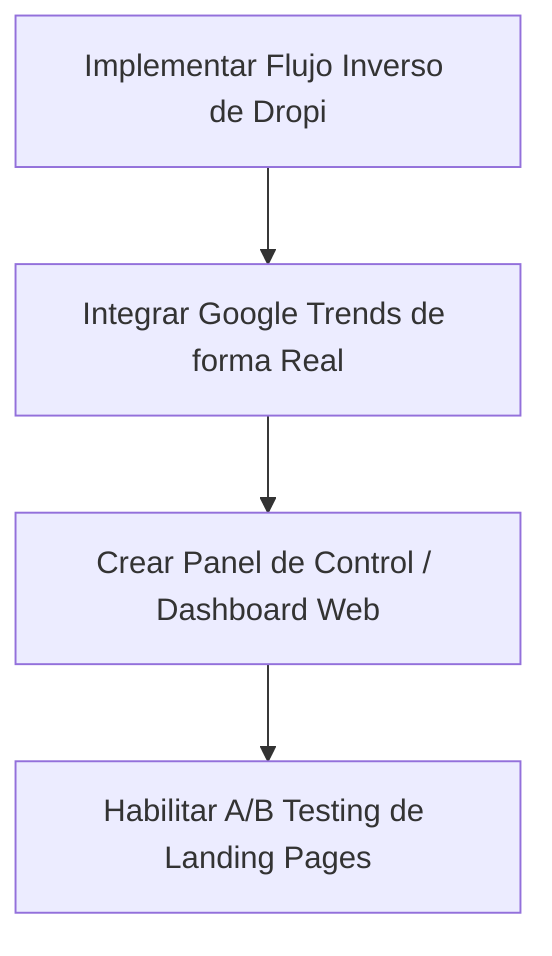

# 📊 Análisis de Estado y Propuestas de Mejora - Proyecto "Funcionara"

Este documento presenta una revisión técnica del estado actual del proyecto **Funcionara**, evalúa su arquitectura y propone mejoras concretas, especialmente en la búsqueda y validación de productos ganadores para el mercado chileno.

---

## 🔍 1. Estado Actual del Proyecto (Fase 2+)

El proyecto se encuentra en un estado **muy avanzado y funcional (casi listo para producción)**. No es un simple producto mínimo viable (MVP); cuenta con una arquitectura basada en eventos/pipeline asíncrono y varios módulos de validación robustos.

### Componentes Clave Operacionales:
1. **Orquestación Principal (`main.py`)**: Coordina las 4 fases fundamentales:
   * **Scout Agent**: Busca candidatos, filtra por estacionalidad, valida criterios, calcula scores y selecciona el ganador.
   * **Creative Agent**: Genera copy comercial con Gemini y crea imágenes.
   * **DevOps Agent**: Genera código HTML/Tailwind responsivo y lo despliega.
   * **Media Buyer Agent**: Genera campañas publicitarias en Meta Ads (en borrador `DRAFT` por seguridad).
2. **Infraestructura de Validación Avanzada (Fase 2 - `agents/`)**:
   * **Estacionalidad (`seasonality.py`)**: Filtra productos según el mes actual y el hemisferio (ej: buscar productos de invierno del hemisferio norte para vender en el invierno de Chile).
   * **Saturación de Mercado (`market_saturation.py`)**: Evalúa la competencia en Mercado Libre Chile, tiendas retail locales (Falabella, Paris, etc.) y Google Shopping.
   * **Validación de Proveedores (`supplier_validation.py`)**: Examina la reputación del vendedor en AliExpress (años, disputas, transacciones, stock).
   * **Tendencias Locales (`local_trends.py`)**: Analiza búsquedas en Mercado Libre y menciones en redes sociales (TikTok/Instagram) locales de Chile.
3. **Mesa de Trabajo Autónoma (`mesa_trabajo_agentes.py`)**:
   * Implementa un bucle infinito inteligente que busca productos en TikTok Shop (vía RapidAPI), filtra por volumen de ventas, traduce con Gemini, valida contra el catálogo de Dropi Chile, comprueba la saturación de anuncios en Meta Ads Chile (vía RapidAPI) y guarda el historial en `historial_memoria.json` para evitar reprocesar nichos o productos ya descartados.
4. **Backend y CRM (`server.py` & `database.py`)**:
   * Servidor FastAPI que expone endpoints para recibir pedidos de la landing page (`/api/order`), conectarse de forma segura a Dropi Chile usando `curl_cffi` para simular un navegador Chrome y evadir el WAF de Cloudflare, persistir datos en base de datos híbrida (SQLite local / PostgreSQL en Supabase) e integrarse con CRM (Evolution API/Twilio) para confirmación de pedidos vía WhatsApp.

---

## 💡 2. Propuestas de Mejora: Nuevas Fuentes para el Producto Ganador

Actualmente, el sistema depende de **TikTok Shop** (vía RapidAPI) y búsquedas genéricas de competidores en la **Librería de Anuncios de Meta**. Para diversificar y encontrar verdaderos "Océanos Azules", se pueden incorporar las siguientes fuentes:

### A. Catálogo Inverso de Dropi (Estrategia de Minería Local) 🇨🇱
* **Problema actual**: El flujo es `Buscar en TikTok (USA) -> Traducir -> Comprobar si hay stock en Dropi`. Muchas veces encontramos productos virales increíbles pero no están disponibles en Dropi Chile o no tienen stock suficiente, lo que frustra el flujo de entrega rápida (COD).
* **Solución**: **Invertir el flujo de búsqueda**.
  1. El Scout Agent se conecta a la API de Dropi Chile y descarga la lista de productos disponibles en el país con **más de 200 unidades en stock** y precio de costo menor a \$15,000 CLP.
  2. Filtramos esos productos locales y consultamos sus equivalentes en inglés en TikTok y Meta Ads Library global.
  3. Si un producto que **ya está en la bodega de Dropi en Santiago** tiene alta viralidad en TikTok en EE. UU., pero pocos anuncios activos en Chile, ¡tenemos un ganador absoluto con envío en 24 horas y cero riesgo de importación!

### B. Pinterest Trends (El Radar de Estilo) 📌
* **Por qué**: Pinterest es la plataforma donde los consumidores planifican compras con meses de anticipación. Los productos de decoración del hogar (`home_decor`), organización, moda y belleza (`beauty`) se vuelven virales en Pinterest antes de llegar a TikTok.
* **Implementación**: Usar un scraper de `Pinterest Trends` o su API de anuncios para extraer keywords con un crecimiento semanal de búsquedas superior al 50%.

### C. Amazon Movers & Shakers 📦
* **Por qué**: Amazon rastrea los mayores incrementos en ventas en las últimas 24 horas en su sección "Movers & Shakers". Es ideal para capturar micro-tendencias de gadgets o productos de cocina antes de que el mercado masivo se entere.
* **Implementación**: Programar un scraper ligero para las categorías clave de Amazon y extraer los productos cuyo ranking de ventas subió drásticamente (ej: de posición 10,000 a 100).

### D. AliExpress DS Center (Dropshipping Center) 🛒
* **Por qué**: AliExpress tiene una sección oculta para dropshippers que muestra los productos más vendidos en tiempo real, tasas de conversión y confiabilidad del proveedor ya evaluada.
* **Implementación**: Reemplazar la simulación de AliExpress en `agents/scout.py` con una API de AliExpress de terceros en RapidAPI o un scraper de curl_cffi que consulte la URL de productos recomendados de AliExpress Dropshipping.

---

## 🛠️ 3. Mejoras Técnicas y de Negocio para el Sistema

### 1. Caching de API & Control de Costos (RapidAPI & Gemini)
* **Situación**: La mesa de trabajo autónoma realiza múltiples llamadas a RapidAPI (TikTok Shop, Meta Ads Library) y Gemini. Si el bucle procesa muchos nichos, el costo de las APIs puede escalar.
* **Mejora**: Implementar un sistema de caché (usando SQLite o la base de datos de Supabase) para que si buscamos un término o producto en las últimas 48 horas, use el resultado almacenado en lugar de gastar créditos de RapidAPI.

### 2. Integración Real de Google Trends
* **Situación**: `agents/scout.py` simula el enriquecimiento de Google Trends mediante números aleatorios.
* **Mejora**: Integrar la librería `pytrends` o un scraper HTTP simple de Google Trends para obtener el interés de búsqueda real del producto en Chile (`geo='CL'`) durante los últimos 30 días.

### 3. A/B Testing de Landing Pages
* **Situación**: El DevOps Agent genera una landing page estándar.
* **Mejora**: Modificar el Creative Agent para generar **dos variaciones de copy** (una enfocada en dolor/beneficio y otra en urgencia/descuento). El DevOps Agent puede subir ambas páginas (ej: `index_a.html` e `index_b.html`) y el servidor puede alternar el tráfico 50/50 para ver cuál genera más pedidos en la base de datos.

### 4. Dashboard Web de Control (Panel de Operaciones)
* **Mejora**: Crear un dashboard interactivo en FastAPI con HTML/CSS simple (o Streamlit) para que puedas:
  * Ver el historial de productos analizados y su puntuación (evitando leer logs pesados).
  * Ver una tabla de pedidos recibidos localmente y su estado de confirmación en Dropi.
  * Cambiar configuraciones del archivo `.env` en tiempo real (márgenes, presupuestos, palabras clave de nicho) desde una interfaz gráfica.
  * Un botón de "Lanzar Pipeline" que te permita aprobar manualmente un producto del TOP 5 antes de generar la landing page y la campaña publicitaria.

---

## 📋 4. Plan de Acción Recomendado

Si deseas continuar desarrollando el proyecto, esta es la secuencia lógica recomendada:

1. **Corto Plazo**: Añadir el scraper/conector para extraer productos directamente desde Dropi Chile con stock activo y pasarlos por el filtro de viralidad.
2. **Medio Plazo**: Reemplazar las simulaciones restantes en `agents/scout.py` (AliExpress, Google Trends) con datos reales y optimizar el consumo de APIs con caché.
3. **Largo Plazo**: Diseñar la interfaz web de control para monitorear el sistema sin usar la consola de comandos.
